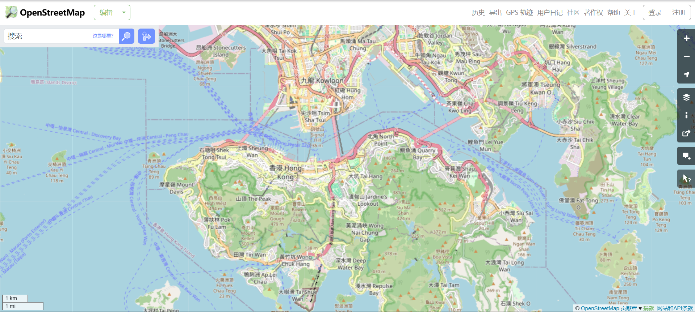
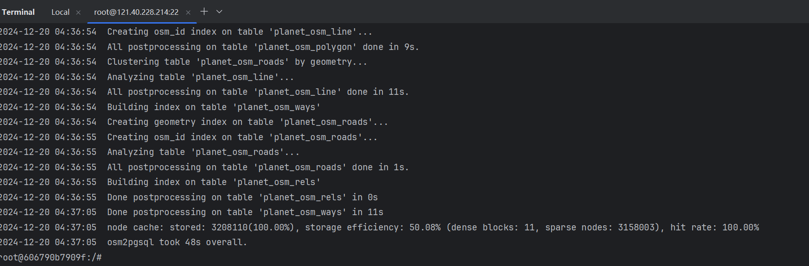

# SDataHK

[openstreetmap](https://www.openstreetmap.org)下载完整数据

# 数据库环境和基本配置

postgresql:huawei cloud,docker port:55433 ip:113.44.45.254

## 需求分析和系统设计

## 空间数据库结构设计

### Original data tables comment:

gis_osm_buildings_a_free_1:MultiPolygon 香港所有建筑

gis_osm_landuse_a_free_1:MultiPolygon 土地利用情况

gis_osm_natural_a_free_1:MultiPolygon 自然景观

gis_osm_natural_free_1:Point 自然景观

gis_osm_places_a_free_1:MultiPolygon 区 村 岛

gis_osm_places_free_1:Point 区 镇

gis_osm_pofw_a_free_1:MultiPolygon 教堂

gis_osm_pofw_free_1:point 教堂

gis_osm_pois_a_free_1:MultiPolygon 学校 法院 超市

gis_osm_pois_free_1:Point 景点 洗手间 餐馆

gis_osm_railways_free_1:MultiLineString 地铁电车轻轨

gis_osm_roads_free_1:MultiLineString 道路

gis_osm_traffic_a_free_1:MultiPolygon 多层停车场 地下停车场 码头

gis_osm_traffic_free_1:Point 交通标志

gis_osm_transport_a_free_1:MultiPolygon 公交站 地铁站

gis_osm_transport_free_1:Point 公交站 地铁站

gis_osm_water_a_free_1:MultiPolygon 水库湿地

gis_osm_waterways_free_1:MultiLineString 水渠 水流 河流

### Edited data tables comment:

## 空间数据编辑与入库

数据编辑:

gis_all_pier:所有码头

gis_all_police:所有的警察局

### 空间数据下载与编辑

[空间数据下载地址](https://download.geofabrik.de/asia/china/hong-kong.html)

### 空间数据入库

入库工具：*osm2pgsql* 这里如果使用QGIS会很慢 .shp文件过大

入库结果：

### 空间数据导出

## 系统功能实现与测试

1. 功能一 地铁站推荐mall 距离地铁站1km以内的所有mall
   这里示例是找到 中環 Central 1km以内的所有商场
2. 功能二 查询区内不同土地利用面积
3. 功能三 查询指定道路边的学校
4. 功能四 台风影响区域分析
5. 功能五 区域绿色占比分析

## 高级语言编码实现功能(golang)

1. 功能一 指定点 找到最近的三个警察局
2. 功能二
3. 功能三
4. 功能四

## 课程总结

## 参考文献
